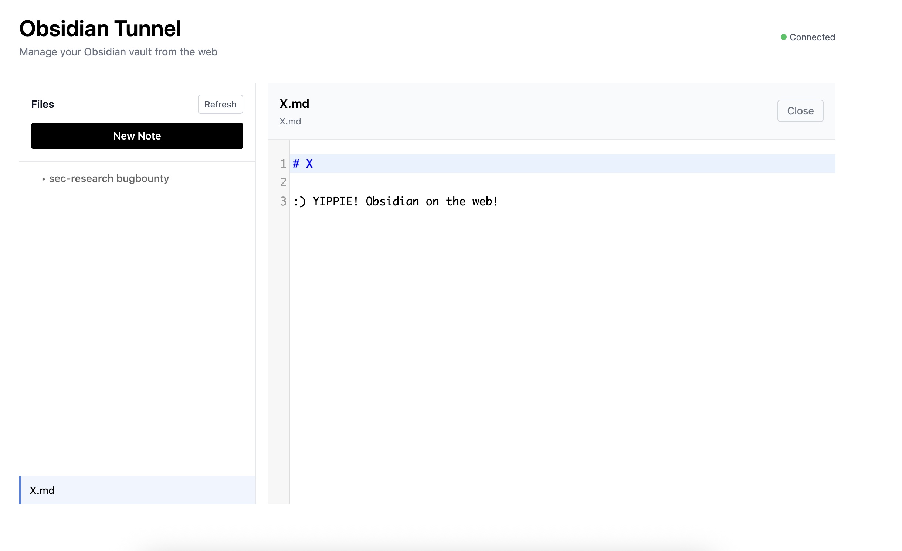

# Obsidian Tunnel

Web interface for managing your Obsidian vault remotely.



## Features

- Browse and manage vault files from any browser
- Create, edit, rename, and delete notes
- Real-time markdown editing with CodeMirror
- Auto-save functionality
- Basic authentication support
- Cloudflare Tunnel support for secure remote access

## Prerequisites

1. **Obsidian** with the **Local REST API** plugin installed and enabled
   - Open Obsidian → Settings → Community Plugins
   - Search for "Local REST API" and install it
   - Enable the plugin and copy your API key

2. **Node.js** (v18+)

## Setup

```bash
git clone https://github.com/PatrikFehrenbach/obsidian-tunnel.git
cd obsidian-tunnel
npm install
npm run build
```

Create `.env`:
```bash
OBSIDIAN_API_KEY=your_api_key_here
PORT=3334
AUTH_USERNAME=your_username
AUTH_PASSWORD=your_password
```

## Run

```bash
./start.sh
```

This starts both the local server and Cloudflare tunnel automatically.

Access:
- Local: `http://localhost:3334`
- Remote: `https://notes.yourdomain.com` (set in `.env`)

## Cloudflare Tunnel Setup

Install and configure once:

```bash
brew install cloudflare/cloudflare/cloudflared
cloudflared tunnel login
cloudflared tunnel create obsidianme
```

Update `.env` with your tunnel ID and hostname.

Create `~/.cloudflared/config.yml`:

```yaml
tunnel: <tunnel-id>
credentials-file: ~/.cloudflared/<tunnel-id>.json
ingress:
  - hostname: notes.yourdomain.com
    service: http://localhost:3334
  - service: http_status:404
```

Route DNS:
```bash
cloudflared tunnel route dns obsidianme notes.yourdomain.com
```

After setup, `./start.sh` will start everything.

## Security

**Warning:** This tool exposes your Obsidian vault over the network. Make sure to:

- Always enable authentication by setting `AUTH_USERNAME` and `AUTH_PASSWORD`
- Use strong, unique passwords
- Only expose via Cloudflare Tunnel or other secure proxy (never expose directly to the internet)
- Keep your `OBSIDIAN_API_KEY` secret

## License

MIT
